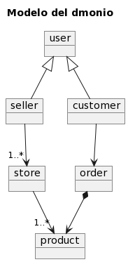
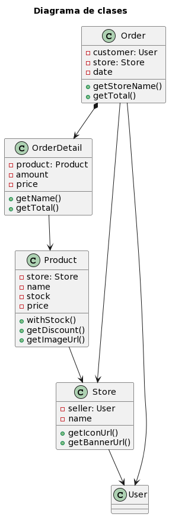
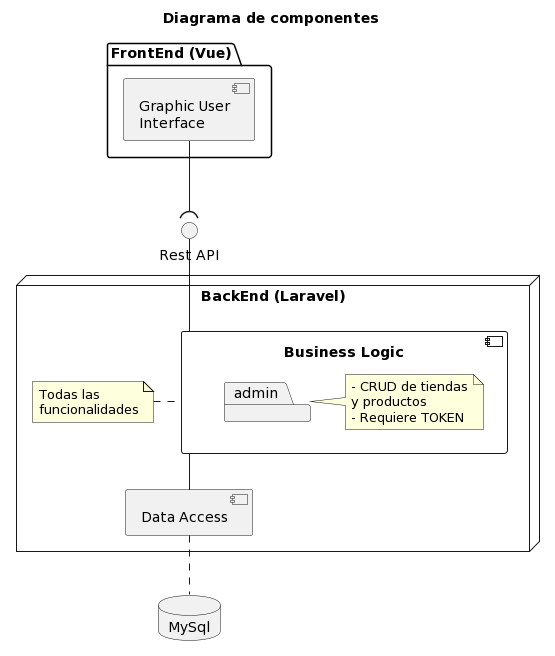

# Project Name: GoodMeal Challenge

### Descripción

El presente proyecto es un reto técnico desarrollado para la empresa GoodMeal

### Tecnologías

* PHP
* Laravel
* VueJs
* MySQL
* Docker
* Docker compose

## Requisitos

- Docker instalado

## Instalación y ejecución 🛠️

- Clonar el proyecto.
- Ingresar a la carpeta del proyecto
- Construir los contenedores: `docker-compose build`
- Iniciar el servicio: `docker-compose up -d`
- Instalar las dependencias del backend: `docker-compose exec crud-service composer install`
- Cambiamos el propietario de la carpeta storage: `docker-compose exec crud-service chown -R www-data:www-data storage`
- Crear el acceso a storage: `docker-compose exec crud-service php artisan storage:link`
- Ejecutar las migraciones: `docker-compose exec crud-service php artisan migrate`
- Ejecutar los seeders: `docker-compose exec crud-service php artisan db:seed`

Los microservicios por defecto corren en los siguientes puertos:

- crud-service: 8000
- frontend: 8080

### Testing ⚙️

Para la ejecución de tests automáticos:

- Ejecutar el servicio con `docker-compose up -d`.
- En otro terminal, ejecutar test para
  crud-service `docker-compose exec crud-service php artisan test --testsuite=Feature`.
- En otro terminal, ejecutar test para el fronted `docker-compose exec frontend yarn run test:unit`.

#### Nota

Una vez ejecutados los test de crud-service hay que volver a ejecutar
`docker-compose exec crud-service php artisan db:seed` para volver a poblar la base de datos

### Endpoints 📄

Para probar los endpoints, una vez iniciado los servicios ingrese al siguiente enlace:
[http://localhost:8000/api/documentation](http://localhost:8000/api/documentation)

### Diagrams

- Modelo del dominio: representa todos los diversos conceptos que manejamos y como se relacionan entre ellos.

- Diagrama de clases: contiene las clases con algunos atributos y métodos esenciales, además de las dependencias entre
  ellos. Está hecho a un nivel más del lado del análisis, no tanto del diseño, ya que no nos centramos en ninguna
  tecnología en particular

- Diagrama de componentes: representan los componentes del software, en esta ocasión a nivel de una arquitectura de
  fronted (vue) y backend (laravel) haciendo referencia que en la parte del backend se dividió un subcomponente admin
  para implementar los CRUDs de tiendas y productos solicitados en este reto técnico.

### Autores ✒️

* **Autor:** Mauro Flores F., mauroflores8193@gmail.com
